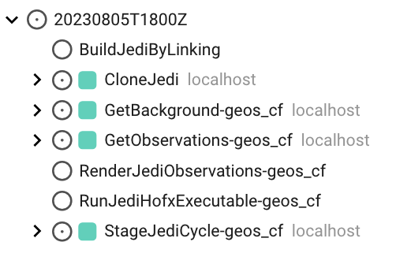
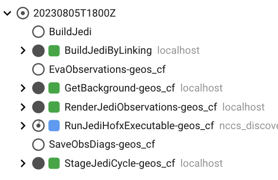

## What is SWELL?

SWELL is a workflow layer that organizes and runs **tasks** within an **experiment**. These tasks
include creating a run directory for each assimilation window; copying or linking observations,
backgrounds, and other input files into that directory; building JEDI input YAML files; running
JEDI executables; and handling JEDI or model output files.

SWELL uses Cylc to manage dependencies among tasks. The order in which the **tasks** run is usually
defined in a file called `flow.cylc`.

Below is an example from the Cylc GUI for a `hofx_cf` experiment:



**Note:** In the Cylc GUI and TUI, tasks are listed alphabetically rather than by execution order or
status.

More information about the JEDI HofX application is available in the previous
[JEDI lecture](https://mer-a-o.github.io/howtojedi/lecture-2/#running-a-jedi-hofx-application).

For each cycle, SWELL creates a run directory and stages the static inputs with
`StageJediCycle-geos_cf`. It copies or links backgrounds and observations into the run directory
with `GetBackground-geos_cf` and `GetObservations-geos_cf`, then creates the JEDI YAML configuration
with `RenderJediObservations-geos_cf`. Next, `RunJediHofxExecutable-geos_cf` runs the JEDI HofX
application. Finally, `SaveObsDiags-geos_cf` stores the feedback files, and `EvaObservations-geos_cf`
generates diagnostics. As SWELL moves through the workflow, each task's box changes color to show
whether the task is queued, running, or finished.

In the example below, the tasks with green boxes have completed successfully, and the task with a
blue box is running:



Learn more about Cylc job states in the
[Cylc documentation](https://cylc.github.io/cylc-doc/latest/html/user-guide/running-workflows/tasks-jobs-ui.html).

### Tasks

SWELL tasks are Python classes located in
[`src/swell/tasks`](https://github.com/GEOS-ESM/swell/tree/develop/src/swell/tasks). The table below
lists the tasks in the `hofx_cf` suite and their responsibilities.

| Task | Responsibility |
|------|----------------|
| `CloneJedi` | Clones the JEDI source repositories |
| `BuildJediByLinking` | Links to an existing build (fast path) |
| `BuildJedi` | Compiles JEDI if linking to an existing build fails (slow path) |
| `GetBackground` | Fetches the forecast files needed for the cycle from R2D2 |
| `GetObservations` | Fetches the observation files from R2D2 |
| `RenderJediObservations` | Fills in the observation-space YAML templates |
| `StageJediCycle` | Stages static files such as coefficients and geometry files |
| `RunJediHofxExecutable` | Runs JEDI under SLURM |
| `EvaObservations` | Generates diagnostic plots and statistics |
| `SaveObsDiags` | Stores the feedback files in R2D2 |
| `CleanCycle` | Deletes large intermediate files |

You can also run any task manually, which is particularly useful when debugging:

```bash
swell task GetObservations $config -d $datetime -m geos_cf
```

### Suites, suite configurations, and experiments

All SWELL **suites** are located in
[`src/swell/suites/`](https://github.com/GEOS-ESM/swell/tree/develop/src/swell/suites). This directory
contains suites for workflows such as 3D-Var, HofX, and data ingestion. A suite is a predefined
workflow that describes the tasks required to perform a particular operation or experiment. Each
suite directory contains a `flow.cylc` file, which defines the task dependency graph, and a
`suite_config.py` file, which defines one or more suite configurations. Suites that produce
diagnostic plots may also contain an `eva` directory with EVA YAML files.

An **experiment** is the runnable workflow produced by the `swell create` command. It is a directory
on disk containing a rendered `experiment.yaml`, a copy of the configuration tree, and a Cylc
workflow that is ready to launch.

You can create a `hofx_cf` experiment by running:

```bash
swell create hofx_cf
```

**Note:** Running `swell create` without a suite name prints the available suites.

Here is an abbreviated example of the contents of an **experiment directory**:

```
<experiment_root>/swell-hofx_cf/
├── configuration/
│   └── jedi/
│       └── interfaces/
│           └── geos_cf/
│               ├── suite_questions.yaml
│               ├── task_questions.yaml
│               ├── ...
│               └── observations/
└── swell-hofx_cf-suite/
    ├── eva/
    │   └── observations-geos_cf.yaml   ← EVA diagnostics configuration
    ├── experiment.yaml                 ← the rendered experiment settings
    ├── flow.cylc                       ← the rendered Cylc task graph
    └── modules                         ← source this to run tasks by hand
```

If you need to modify configuration files after running `swell create`, edit the copies under
`<experiment_root>/<experiment_id>/configuration/`, not the files in the SWELL source tree. Cylc
uses the configuration stored in the experiment directory when it runs the workflow.

### Next Step:
In the next lecture, we cover installing SWELL and configuring an experiment.
