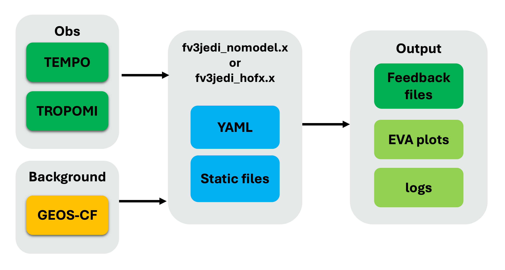

# Running the `hofx_cf` suite

The `hofx_cf` suite runs the
[JEDI HofX application](https://mer-a-o.github.io/howtojedi/lecture-2/) with the GEOS-CF
(composition forecast) interface. The application requires background, observation, and static
input files. Its
[HofX YAML configuration](https://mer-a-o.github.io/howtojedi/lecture-2/#running-a-jedi-hofx-application)
specifies information such as input filenames, model resolution, and the data-assimilation window.

Based on the experiment configuration, SWELL creates a cycle-specific run directory, copies or
links the background and observation files, stages the static files, and renders the HofX YAML from
templates. The workflow then runs the `fv3jedi_hofx_nomodel.x` executable. Finally, it handles the
IODA observation-space feedback files and runs EVA to generate diagnostics.



## Task dependencies

The tasks and dependencies for the `hofx_cf` suite are defined in
[`src/swell/suites/hofx_cf/flow.cylc`](https://github.com/GEOS-ESM/swell/blob/develop/src/swell/suites/hofx_cf/flow.cylc).
The file has two main sections: `[scheduling]`, which defines the task graph, and `[runtime]`, which
defines how each task runs.

Under `[scheduling][[graph]]`, the `=>` operator creates a success trigger: the task on the right can
start only after the task on the left succeeds. For example:

```text
GetObservations-{{model_component}} => RenderJediObservations-{{model_component}}
```

This line means that `GetObservations` must succeed before `RenderJediObservations` can start. The
suite also uses the following Cylc syntax:

- `?` marks an optional output, so the graph does not stall if that output is not produced. For
  example, `BuildJediByLinking?` is optional because the workflow can build JEDI instead.
- `:fail?` creates an optional failure trigger. The expression
  `BuildJediByLinking:fail? => BuildJedi` tells Cylc to build JEDI from source if linking to an
  existing build fails.
- `|` is a logical OR. In
  `BuildJediByLinking[^]? | BuildJedi[^] => RunJediHofxExecutable`, the executable can start after
  either build path completes.
- `[^]` refers to the task instance at the initial cycle point. This allows the one-time build tasks
  to satisfy dependencies in every cycle.

The graph is split into two parts: an `R1` block for tasks that run once, such as cloning and
building JEDI, and a per-cycle block generated from `cycle_times` and `model_components` with
Jinja2. Because `hofx_cf` uses one model component, `geos_cf`, each cycle-dependent task is named
`<Task>-geos_cf`.

The `[runtime]` section maps these graph names to `swell task` commands and defines settings such as
the execution platform, time limit, and SLURM directives.

### What each task does

- **CloneJedi** — Clones the JEDI source through `jedi_bundle` or links to an existing source
  directory, depending on `jedi_build_method`.
- **BuildJediByLinking** — Links to an existing JEDI build directory. This is the fast path used by
  `use_existing` and `use_pinned_existing`.
- **BuildJedi** — Compiles JEDI from source with `jedi_bundle` when an existing build cannot be
  linked. This task runs on a compute node with its own SLURM directives.
- **GetBackground** — Fetches the background fields for the cycle from R2D2.
- **GetObservations** — Fetches the observation files for the cycle from R2D2. Depending on the
  configuration, a missing observation may be replaced with an empty file so that the run can
  continue.
- **StageJediCycle** — Stages the cycle-dependent static files defined by
  `configuration/jedi/interfaces/<model>/model/stage_cycle.py`, resolving settings such as the
  horizontal and vertical resolutions.
- **RenderJediObservations** — Renders the per-observation JEDI YAML, including observation spaces,
  window parameters, and any required coefficients, into the cycle directory.
- **RunJediHofxExecutable** — Assembles the complete HofX YAML and runs the JEDI executable. This is
  the main compute task and runs on a compute node with SLURM directives.
- **EvaObservations** — Runs EVA (Evaluation and Verification of the Analysis) on the
  observation-space output to produce diagnostic plots and statistics.
- **SaveObsDiags** — Stores the observation feedback files in R2D2. This task is included in the
  graph only when R2D2 is enabled—that is, when the experiment is not created with `--skip-r2d2`.
- **CleanCycle** — Removes large intermediate files matching `clean_patterns` after EVA and, when
  applicable, the R2D2 save have completed.

## Exploring the run and log directories

The experiment files are stored under `<experiment_root>/<experiment_id>`. For example:

```text
/discover/nobackup/mabdiosk/SwellExperiments/swell-hofx_cf
```

### Run directory

Tasks that receive a cycle and model component write to a cycle-specific directory:

```text
<experiment_root>/<experiment_id>/run/<YYYYMMDDTHHMMSSZ>/<model_component>/
```

For example:

```text
.../swell-hofx_cf/run/20230805T180000Z/geos_cf/
```

This directory contains the fetched background and observation files, rendered JEDI YAML, HofX
log, feedback files, and EVA output. `CleanCycle` later removes the large files that match the
configured cleanup patterns.

### Log directory

Cylc keeps its workflow and job logs under `~/cylc-run/<experiment_name>/`. The standard output and
standard error for each task instance are stored under:

```text
~/cylc-run/<experiment_name>/log/job/<cycle_point>/<task_name>/<submit_num>/
```

Each directory contains `job.out`, which includes SWELL task logging, and `job.err`. This is the
first place to look when a task turns red in `cylc tui`.

To avoid using space in `$HOME`, you can place the `cylc-run` directory under
`/discover/nobackup/$USER/SwellExperiments/` and create a symbolic link to it from `$HOME`.

## Final outputs

The primary outputs of `hofx_cf` are the **observation-space feedback files**, also called H(x)
diagnostic files, produced by `RunJediHofxExecutable`. The suite also produces EVA diagnostics with
`EvaObservations`.

The feedback files are first written to the cycle's run directory. When R2D2 is enabled,
`SaveObsDiags` stores them as R2D2 `feedback` items using the R2D2 experiment ID, observation type,
and data-assimilation window (`window_start` and `window_length`). `CleanCycle` may subsequently
remove the local copies according to `clean_patterns`.

### Fetching feedback files later

Because the feedback files are stored in R2D2, you can retrieve them after the run or from another
experiment with the `r2d2` utility. Fetch the `feedback` item using the matching R2D2 experiment ID,
observation type, window start, and window length.

## About `experiment_id` and `r2d2_experiment_id`

These settings identify the same workflow in different places:

- `experiment_id` is SWELL's **local** name for the experiment. It determines the experiment
  directory (`<experiment_root>/<experiment_id>`), suite directory (`<experiment_id>-suite`), and
  names used in local files and configuration.
- `r2d2_experiment_id` is the name registered in **R2D2**. Tasks that save products, such as
  `SaveObsDiags`, use it as the R2D2 `experiment` key. Cycling suites also use it when fetching
  products generated by earlier cycles.

By default, both IDs begin with the suite-derived name, which is `swell-hofx_cf` for this suite.
R2D2 experiment names must be unique, so `swell create` checks whether the requested name is already
registered. If it is, SWELL appends a random eight-character hexadecimal suffix.

The final values are recorded in the generated configuration:

```text
/discover/nobackup/${USER}/SwellExperiments/swell-hofx_cf/swell-hofx_cf-suite/experiment.yaml
```

For example:

```yaml
experiment_id: swell-hofx_cf
r2d2_experiment_id: swell-hofx_cf-04338501
```

In this example, the local files remain under `swell-hofx_cf`, while the feedback files are stored
in R2D2 under `swell-hofx_cf-04338501`. When fetching feedback later, use the **final
`r2d2_experiment_id` recorded in `experiment.yaml`**, which may differ from the local
`experiment_id`.

## Running with an override file

As described in [2.configure.md](2.configure.md), reusable override files are stored in the
[`swell-config` repository](https://github.com/GEOS-ESM/swell-config) so that configuration changes
can be tracked and shared.

The following `override_hofx.yaml` configures two six-hourly cycles:

```yaml
# Use with: swell create hofx_cf -o override_hofx.yaml

experiment_id: ops_cf_hofx_20251010T12_20251010T18

# SWELL appends a hexadecimal suffix if this R2D2 ID is already registered.
r2d2_experiment_id: ops_cf_hofx_20251010T12_20251010T18

start_cycle_point: '2025-10-10T12:00:00Z'
final_cycle_point: '2025-10-10T18:00:00Z'

model_components:
  - geos_cf

models:
  geos_cf:
    jedi_build_method: use_existing
    check_for_obs: false
    window_length: PT6H
    window_type: 3D

    # Must match the background experiment stored in R2D2.
    background_experiment: geos_cf_oper
    background_time_offset: PT9H
    horizontal_resolution: c360
    vertical_resolution: 72
    npx: 361
    npy: 361

    # Must match the observations stored in R2D2.
    observations:
      - tempo_no2_tropo

    observation_providers:
      tempo_no2_tropo: nasa_v4

    clean_patterns:
    #- '*.nc4'
    - '*.txt'
    - logfile.*.out
```

Create the experiment with:

```bash
swell create hofx_cf -o override_hofx.yaml
```

The experiment is installed under
`/discover/nobackup/${USER}/SwellExperiments/<experiment_id>`. Launch it using the command printed by
`swell create`:

```bash
swell launch <path_printed_by_swell_create>
```

Each `hofx_cf` cycle is independent of the previous cycle, so multiple cycles may run concurrently,
subject to the Cylc runahead limit and the availability of compute resources.
