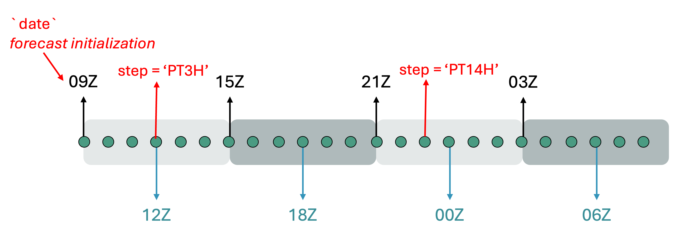

# Running the `ingest_background_cf` configuration

The `ingest_background_cf` registers GEOS-CF background files that already exist on the CSS shared
filesystem in R2D2, so that downstream suites such as [`hofx_cf`](3.hofx_cf.md) can retrieve them
with `GetBackground`. It is a simpler workflow than `ingest_obs_cf`: it does not download, convert,
or modify anything. It finds each hourly file, checks that it exists, and stores its metadata in
R2D2, normally as a symlink rather than as another copy.

As described in [4.ingest_workflows_r2d2.md](4.ingest_workflows_r2d2.md), and like
[`ingest_obs_cf`](5.ingest_obs_cf.md), `ingest_background_cf` is not a separate suite directory. It
is a configuration of the shared
[`r2d2_ingest`](https://github.com/GEOS-ESM/swell/tree/develop/src/swell/suites/r2d2_ingest) suite
that sets `ingest_background_pipeline: true`, which selects the `SaveBackground` branch of the shared
[`flow.cylc`](https://github.com/GEOS-ESM/swell/blob/develop/src/swell/suites/r2d2_ingest/flow.cylc).

Here is a list of R2D2 keys used for `item='forecast'` (see
[4.ingest_workflows_r2d2.md](4.ingest_workflows_r2d2.md) for the full item reference):

```python
import r2d2

# r2d2.fetch to get the data from R2D2 or r2d2.store to save the data on R2D2
r2d2.fetch(
  item='forecast',
  model='geos_cf', # other options include cice6 and mom6
  experiment='swell_test', # r2d2_experiment_id
  resolution='c90',
  step='PT3H', # forecast lead time, the elapsed duration from the forecast initialization time (`date`). Forecast valid_time = date + step
  date='2023-08-05T09:00:00Z',
  file_extension='nc', # this is not a very consistent key and may be deprecated at some point
  target_file='bkg.20230805T180000Z.nc4'
  )
```

## The 09Z convention for `geos_cf_oper`

`ingest_background_cf` is designed to ingest the `jdi` collection from the GEOS-CFv2 operational
run, so a few assumptions about that collection are currently hard-coded. GEOS-CFv2 runs one
forecast per day, initialized at `09Z`, and the collection holds 24 hourly files from it. The suite
therefore treats the cycle point as the **forecast initialization time** and derives the R2D2 `step`
as the offset from `09Z`:

| R2D2 step | Valid time for a 2025-10-02 09Z cycle |
|-----------|----------------------------------------|
| `PT0H` | 2025-10-02 09Z |
| `PT1H` | 2025-10-02 10Z |
| ... | ... |
| `PT15H` | 2025-10-03 00Z |
| `PT23H` | 2025-10-03 08Z |

Because of this, `start_cycle_point` and `final_cycle_point` must be at 09Z, and `cycle_times` must
stay `['T09']`. `SaveBackground` checks the cycle hour and aborts with an explanatory message if it
receives anything else. This may change in the future if other collections need to be ingested.




## Configuring `ingest_background_cf`

The `ingest_background_cf` block in
[`suite_config.py`](https://github.com/GEOS-ESM/swell/blob/develop/src/swell/suites/r2d2_ingest/suite_config.py)
includes the default values. To configure and customize the experiment use an override file. See
[2.configure.md](2.configure.md) for more details.

```yaml
experiment_id: training_ingest_background # Swell experiment_id, this doesn't impact R2D2

start_cycle_point: '2025-10-10T09:00:00Z' # first 09Z forecast initialization to ingest
final_cycle_point: '2025-10-10T09:00:00Z' # last 09Z forecast initialization to ingest
cycle_times: ['T09'] # default; must stay T09
model_components:
  - geos_cf
ingest_background_pipeline: true # run the SaveBackground branch

models:
  geos_cf:
    # The default already points at the GEOS-CFv2 jdi collection,
    # so you normally do not need to set this.
    background_source_path: /css/gmao/geos-cf/NRTv2/priv/ana/Y%Y/M%m/D%d/GEOS.cf.ana.jdi_inst_1hr_glo_C360x360x6_v72.%Y%m%d_%H%Mz.R0.nc4
    background_experiment: geos_cf_oper # R2D2 experiment name for the GEOS-CFv2 jdi collection
    horizontal_resolution: c360 # GEOS-CFv2 resolution is c360

    # Set true for preview and false for actually saving the files to r2d2
    dry_run: false
    store_as_symlink: true # keep it true for backgrounds, so no data is copied
```

Most of these are already the defaults: `cycle_times: ['T09']`, `background_experiment:
geos_cf_oper`, `horizontal_resolution: c360`, `store_as_symlink: true`, and the
[`background_source_path`](https://github.com/GEOS-ESM/swell/blob/develop/src/swell/utilities/question_defaults.py#L1830-L1834)
template. In practice you only need to set `experiment_id`, the cycle points, and `dry_run`. They
are all listed above so you can see the full set of keys that control the ingest.

Note that `dry_run` defaults to `true`, so a bare `swell create ingest_background_cf` gives you a
preview run: it checks which source files exist and logs the R2D2 operations it *would* perform
without storing anything. That is a good first thing to run.

## Creating and running the `ingest_background_cf`

The steps are the same as any other suite (see [3.hofx_cf.md](3.hofx_cf.md)):

1. Load the SWELL environment and make sure your R2D2 credentials are set (see
   [2.configure.md](2.configure.md)). No Earthdata credentials are needed here, since nothing is
   downloaded.

2. Create the experiment by running `swell create ingest_background_cf -o override_background.yaml`.
This will print the launch command, e.g.:

```bash
SwellCreateExperiment:  
SwellCreateExperiment: Experiment successfully installed. To launch experiment use: 
SwellCreateExperiment:  
SwellCreateExperiment:   swell launch /discover/nobackup/mabdiosk/SwellExperiments/swell-ingest_background_cf/swell-ingest_background_cf-suite
SwellCreateExperiment:  
```

Here is an example of what is in an **experiment directory**:

```text
<experiment_root>/<experiment_id>/
├── configuration/
└── <experiment_id>-suite/
    ├── flow.cylc
    ├── experiment.yaml                    ← the only file SaveBackground reads
    └── modules
```

`swell create` copies the whole `configuration/` tree, but unlike `ingest_obs_cf` this workflow has
no per-item YAML files to read: everything `SaveBackground` needs comes from `experiment.yaml`.

3. Launch it with `swell launch <path_to_suite_directory>` using the path printed by `swell create`.

## Tasks in `ingest_background_cf`

With `ingest_background_pipeline: true`, the suite runs a single task:

Only once:
- (none — there is no JEDI clone or build, because no executable is run)

Each cycle:
- SaveBackground

### What each task does

- **SaveBackground** — Reads the source path template and R2D2 keys from `experiment.yaml`, loops
  over the 24 hourly steps of the 09Z forecast, and stores each existing file in R2D2 as a
  `forecast` item. The implementation lives in
  [`src/swell/tasks/save_background.py`](https://github.com/GEOS-ESM/swell/blob/develop/src/swell/tasks/save_background.py).

  For each cycle it:

  1. Loads the user's R2D2 credentials.
  2. Verifies that the forecast initialization hour is 09Z, and aborts if it is not.
  3. Loops from hour offset 0 through 23.
  4. Calculates the valid time and R2D2 step (`PT0H` through `PT23H`).
  5. Expands `background_source_path` for that valid time.
  6. Checks that the source file exists. Missing files generate warnings and are skipped.
  7. In dry-run mode, logs what would be stored. Otherwise, calls `r2d2.store()`.
  8. Reports the numbers of stored and skipped files.

Each real store uses these R2D2 keys:

```python
r2d2.store(
    item='forecast',
    model='geos_cf',
    experiment='geos_cf_oper',
    resolution=horizontal_resolution,
    date=forecast_start,   # the 09Z forecast initialization
    step='PT0H',           # changes for each hourly file: PT0H ... PT23H
    file_type='bkg',
    file_extension='nc4',
    source_file=source_file,
    store_as_symlink=store_as_symlink,
)
```

Notice that the R2D2 `date` represents the 09Z **forecast initialization**, while `step` locates
the hourly valid time within that forecast.

Like the obs ingest tasks, `SaveBackground` honors `dry_run: true`, in which case it logs what it
*would* store without writing anything to R2D2. It still checks that each source file exists, so a
dry run reports only the files that are actually present.

## `background_experiment` versus `r2d2_experiment_id`

`SaveBackground` stores files under `background_experiment`; it does **not** use the workflow's
`r2d2_experiment_id`. For example, with:

```yaml
experiment_id: swell-ingest_background_cf
r2d2_experiment_id: swell-ingest_background_cf-a1b2c3d4
models:
  geos_cf:
    background_experiment: geos_cf_oper
```

the local workflow is named `swell-ingest_background_cf`, but the background files are indexed in
R2D2 under `geos_cf_oper`. A downstream `hofx_cf` experiment must use the same value:

```yaml
models:
  geos_cf:
    background_experiment: geos_cf_oper
    horizontal_resolution: c360
```

`GetBackground` then fetches `item='forecast'`, `model='geos_cf'`, `file_type='bkg'`, and the
matching experiment, resolution, initialization date, and step.

For example, a 3D `hofx_cf` cycle at 18Z with `window_length: PT6H` computes a 09Z forecast
initialization and requests `PT9H`. That key selects the file valid at 18Z from the 24-file set
registered by the 09Z ingest cycle.

## Exploring log and run directories

Same layout as other suites (see [3.hofx_cf.md](3.hofx_cf.md)):

- **Run directory** — per cycle/model under
  `<experiment_root>/<experiment_id>/run/<YYYYMMDDTHHMMSSZ>/<model_component>/`. The task base
  creates this directory as usual, but `SaveBackground` reads directly from the configured shared
  path and does not stage the background files there, so it stays essentially empty.

- **Log directory** — cylc job logs under
  `~/cylc-run/<experiment_name>/log/job/<cycle_point>/SaveBackground-geos_cf/<submit_num>/` with
  `job.out` and `job.err`. Check `job.out` for each resolved source filename and the final
  stored/skipped counts, and `job.err` for failures. This is the first place to look when the
  ingest does not produce what you expect.

Common problems are:

- **The task aborts immediately:** the cycle hour is not 09Z. Keep `cycle_times: ['T09']` and use
  09Z start/final cycle points.
- **Files are skipped:** compare the expanded path in `job.out` with the CSS directory.
- **A downstream suite cannot fetch the files:** make sure `background_experiment`,
  `horizontal_resolution`, model, file type, initialization time, and step match the stored keys.
- **A symlink store reports a permission warning:** the task contains a workaround for an R2D2
  `chmod` issue. It continues only after verifying that the created symlink points to the expected
  source; any other `PermissionError` is raised normally.

## Final output

The deliverable is **GEOS-CF background files registered in R2D2 as `forecast` items**. A successful
non-dry run registers up to 24 items per 09Z cycle. With `store_as_symlink: true`, the R2D2
datastore contains links to the authoritative CSS files rather than duplicate NetCDF files. These
registered backgrounds are then ready for `hofx_cf` and other GEOS-CF workflows to retrieve through
**`GetBackground`**.

Set `dry_run: true` to validate the pipeline end-to-end without writing anything to R2D2.

Together, the two ingest configurations satisfy the input side of the HofX workflow contract:

```text
ingest_obs_cf        → R2D2 observation → GetObservations ─┐
                                                           ├─► RunJediHofxExecutable
ingest_background_cf → R2D2 forecast    → GetBackground   ─┘
```

The *producer* and *consumer* configurations must agree on the relevant R2D2 keys. For observations,
that includes the provider, observation type, file extension, and window. For backgrounds, it
includes the model, background experiment, resolution, initialization date, step, file type, and
file extension. Once those contracts match, the HofX configuration does not need to know the
physical source paths used by either ingest workflow.

## Appendix: `SaveBackground` vs. `SaveForecastCf`, and `GetBackground`

Swell has **two** tasks that write `item='forecast'` into R2D2, and **one** task that reads it back.
It is easy to confuse the two writers because they store the same item and the same `file_type='bkg'`,
but they exist for different reasons and are used by different suites.

- [`SaveBackground`](https://github.com/GEOS-ESM/swell/blob/develop/src/swell/tasks/save_background.py)
  registers backgrounds that **someone else already produced** — the GEOS-CFv2 operational `jdi`
  collection sitting on CSS. This is the task run by `ingest_background_cf`.
- [`SaveForecastCf`](https://github.com/GEOS-ESM/swell/blob/develop/src/swell/tasks/save_forecast_cf.py)
  registers backgrounds that **swell itself just produced** by running the GEOS-CF model. It runs at
  the end of every cycle of
  [`3dvar_cf_cycle`](https://github.com/GEOS-ESM/swell/blob/develop/src/swell/suites/3dvar_cf_cycle/flow.cylc#L72),
  right after `RunForecast`.
- [`GetBackground`](https://github.com/GEOS-ESM/swell/blob/develop/src/swell/tasks/get_background.py)
  is the consumer, and it has to be able to read files written by *either* of them.

### Side-by-side

| | `SaveBackground` | `SaveForecastCf` |
|---|---|---|
| Suite | `r2d2_ingest` / `ingest_background_cf` | `3dvar_cf_cycle` (after `RunForecast`) |
| Source of the data | external, pre-existing files on CSS | files written by this experiment's forecast |
| Where it reads from | `background_source_path` strftime template | `<cycle_dir>/scratch/CF2.geoscf_jedi.<time>.nc4` |
| R2D2 `experiment` | `background_experiment` (e.g. `geos_cf_oper`) | `r2d2_experiment_id` (this experiment's own id) |
| R2D2 `date` | the 09Z forecast initialization = cycle time | `window_begin` = cycle time − ½ `window_length` |
| R2D2 `step` | fixed `PT0H` … `PT23H` (24 hourly steps) | `forecast_output_frequency` … `forecast_length` |
| `file_extension` | `nc4` | `nc` |
| `store_as_symlink` | `True` by default (no data copied) | always `False` (a real copy) |
| Missing source file | warns and skips, keeps going | aborts the task |
| Dry-run support | yes (`dry_run`) | no |

Two consequences worth internalizing:

1. **`SaveForecastCf`'s step list starts at one output interval, not at `PT0H`.** The loop in
   [`save_forecast_cf.py:60-85`](https://github.com/GEOS-ESM/swell/blob/develop/src/swell/tasks/save_forecast_cf.py#L60-L85)
   begins at `step_dur = forecast_frequency_dur`, so with `forecast_output_frequency: PT1H` the first
   stored step is `PT1H`. `SaveBackground` does store `PT0H`, because the 09Z analysis file itself is
   part of the collection.
2. **`SaveBackground` is deliberately forgiving and `SaveForecastCf` is deliberately strict.** A gap in
   the NRT archive is a normal, external fact you want logged and skipped; a missing forecast file
   means the cycle you just ran is broken, so it fails loudly.

### The two modes of `GetBackground`

`GetBackground` picks its R2D2 keys in two different ways, and the switch is not a user-facing
option — it is inferred from the configuration.

**Which experiment to fetch from** is decided at
[`get_background.py:77-80`](https://github.com/GEOS-ESM/swell/blob/develop/src/swell/tasks/get_background.py#L77-L80):

```python
if self.cycle_time_dto() != self.start_cycle_point_dto() and 'cycle' in self.suite_name():
    background_experiment = self.config.r2d2_experiment_id()
else:
    background_experiment = self.config.background_experiment()
```

So in a cycling suite (one whose name contains `cycle`, such as `3dvar_cf_cycle`), only the **first**
cycle reads the ingested `geos_cf_oper` backgrounds. Every later cycle reads its own
`r2d2_experiment_id`, i.e. the forecast that `SaveForecastCf` stored one cycle earlier. In a
non-cycling suite such as `hofx_cf` or `3dvar_cf`, the condition is never true and every cycle uses
`background_experiment`.

**Which date and step to request** then follows from that choice, at
[`get_background.py:148-204`](https://github.com/GEOS-ESM/swell/blob/develop/src/swell/tasks/get_background.py#L148-L204):

```python
use_geos_cf_oper_background = (
    model_component == 'geos_cf'
    and background_experiment == 'geos_cf_oper'
)
```

- **GEOS-CF operational mode** (`use_geos_cf_oper_background` is true). The helpers
  `geos_cf_oper_forecast_start` and `geos_cf_oper_step` re-derive the keys against the fixed 09Z
  initialization: they snap the valid time back to the most recent 09Z (going back a day if the valid
  time is before 09Z) and express the offset as `PT<n>H`. `file_extension` is forced to `nc4`. These
  two helpers exist purely to reproduce, on the fetch side, the convention that `SaveBackground`
  hard-codes on the store side — the docstring of `geos_cf_oper_step` says as much: *"Return a
  GEOS-CF v2 R2D2 step string matching SaveBackground."*
- **Standard swell mode** (anything else). The forecast start is the generic swell one,
  `forecast_start_time = cycle_time − window_length + forecast_offset`, and `file_extension` is
  derived from `file_type`. This is the path that lines up with `SaveForecastCf`.

That second path is worth working through once, because the arithmetic is what makes the cycling loop
close. With `window_type: 3D`, `forecast_offset = −½ · window_length`, so:

```text
GetBackground asks for:   date = cycle − 1.5 · window_length
                          step = window_length − forecast_offset = 1.5 · window_length

SaveForecastCf stored:    date = window_begin of the previous cycle
                               = (cycle − window_length) − 0.5 · window_length
                               = cycle − 1.5 · window_length          ✓ same instant
```

and the requested step lands inside the stored range as long as `1.5 · window_length` is both a
multiple of `forecast_output_frequency` and no larger than `forecast_length`. With the defaults
(`window_length: PT6H`, `forecast_output_frequency: PT1H`, `forecast_length: PT12H`) the request is
`PT9H`, which is stored. If you shorten `forecast_length` below `1.5 · window_length`, the next
cycle's `GetBackground` will fail with an R2D2 "not found" even though the forecast ran fine.

### The full picture

```text
ingest_background_cf                 3dvar_cf_cycle
────────────────────                 ──────────────
SaveBackground                       cycle 1: GetBackground ──► ... ──► RunForecast ──► SaveForecastCf
  experiment = geos_cf_oper                    │ (background_experiment)                       │
  date = 09Z init, step = PT0H..PT23H          │                                               │
  symlinks to CSS                              ▼                                               ▼
        │                             ┌──────────────────┐                        ┌──────────────────────┐
        └────────────────────────────►│ R2D2 geos_cf_oper│                        │ R2D2 <r2d2_exp_id>   │
                                      └──────────────────┘                        └──────────────────────┘
                                                                                              │
                                       cycle 2+: GetBackground ◄──────────────────────────────┘
                                                 (r2d2_experiment_id)
```

`ingest_background_cf` only ever has to seed the *first* cycle of a cycling experiment — after that the
experiment feeds itself. For a non-cycling suite such as `hofx_cf`, however, **every** cycle reads from
the ingested `geos_cf_oper` archive, so the ingest must cover every cycle you intend to run.

### Practical notes

- **The three tasks format `date` differently** — `'%Y%m%d_%H%Mz'` in `SaveBackground`,
  `'%Y%m%dT%H%M%S%z'` in `SaveForecastCf`, `'%Y-%m-%dT%H:%M:%SZ'` in `GetBackground`. R2D2 parses the
  string into a datetime, so what has to match is the *instant*, not the spelling. Don't "fix" one of
  them to look like the others.
- **`geos_cf_oper` is a magic string.** Renaming your ingest experiment to anything else silently
  turns off the 09Z re-derivation in `GetBackground`, and the standard-mode keys will not match what
  `SaveBackground` stored. If you want a separate ingest namespace, you have to change the check in
  `get_background.py` as well.
- **Only `SaveBackground` writes symlinks.** `SaveForecastCf` passes `store_as_symlink=False`, so the
  `PermissionError` workaround described above does not apply to it — and a `chmod` failure there is a
  real error.
- **`file_type` is `bkg` for both writers**, which is why the same `fetch.fc` entry in the
  [`geos_cf` R2D2 interface](https://github.com/GEOS-ESM/swell/blob/develop/src/swell/configuration/jedi/interfaces/geos_cf/model/r2d2.py)
  works for both sources; only `experiment`, `date`, `step`, and `file_extension` differ.
